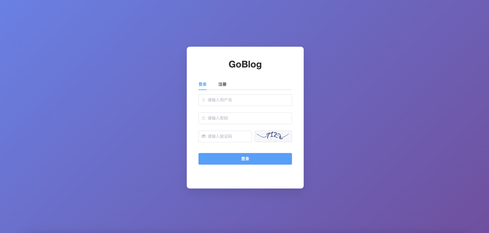
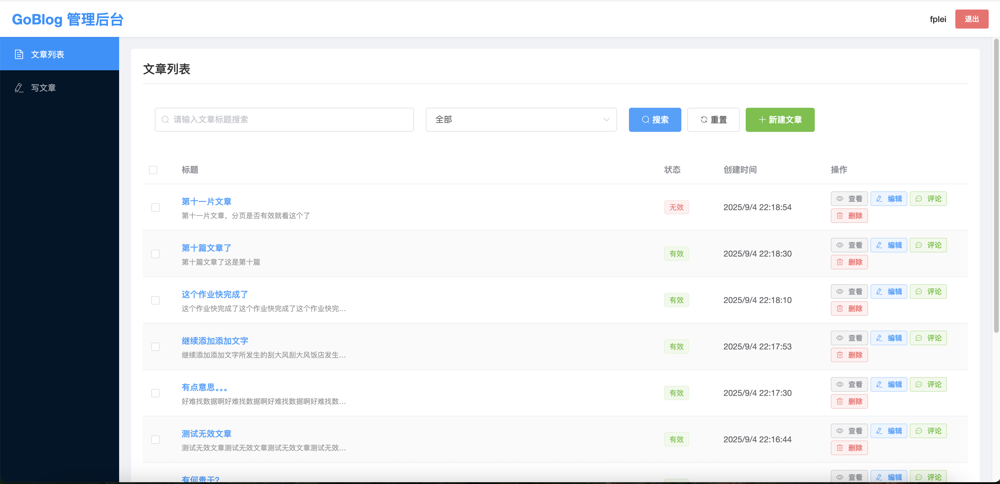
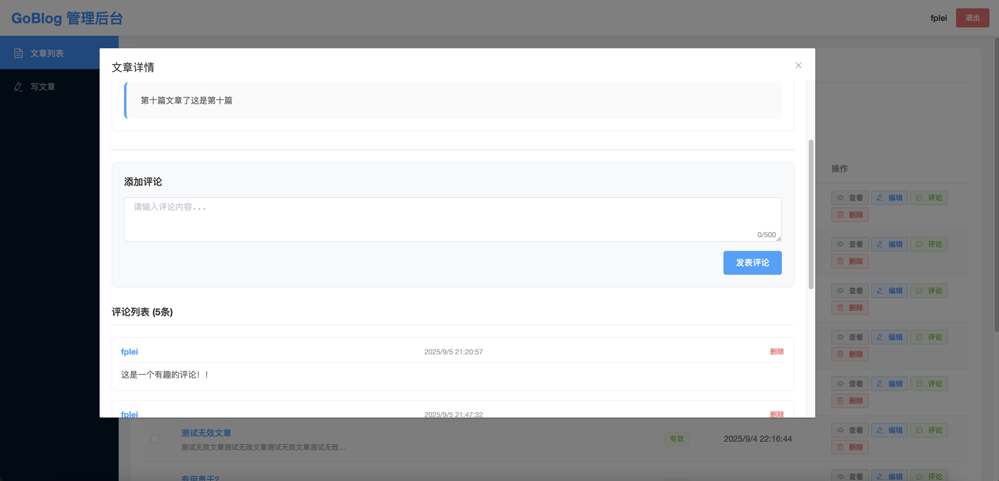

# GoBlog 博客管理系统

### GoBlogServer - 后端服务
**GoBlogServer** 是博客管理系统后台，基于gin的轻mvc架构。提供完整的博客管理API接口，包括用户管理、文章管理、评论管理等功能。

### web - 前端管理系统
**web** 是博客管理的前端web，基于vue2的管理系统。提供直观的用户界面，方便管理员进行博客内容的管理和维护。

## 效果图展示

### 登录页面


### 首页


### 详情页面


## 技术栈

### 后端
- Go
- Gin框架
- MVC架构

### 前端
- Vue 2
- 管理系统界面

## 项目结构

```
GoBlog/
├── GoBlogServer/     # 后端服务
├── web/             # 前端管理系统
├── example/         # 效果图
└── README.md        # 项目说明
```
